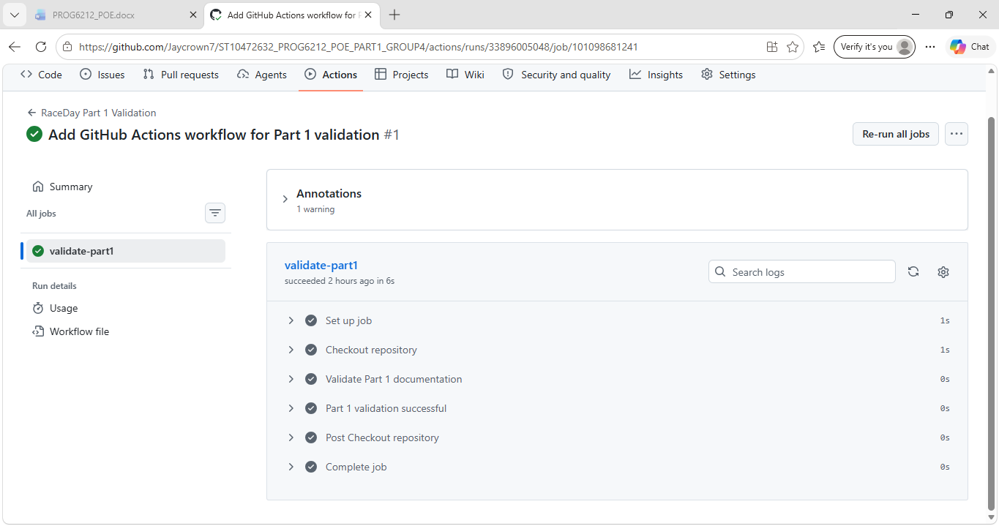

# ST10472632_PROG6212_POE_PART1_GROUP4
ST10472632

# RaceDay

## Project Overview

RaceDay is a full-stack web-based event management system designed for the South African road running, walking, and cycling community.

The system allows Event Organisers to create and manage events, categories, participant enrolments, and race results. Participants can browse available events, enter events by selecting a category, view their enrolments, and track their personal results.

RaceDay is being developed progressively across three parts, with Part 1 focusing on system planning, database design, and API planning.

## User Roles

### Organiser

An Organiser can:

- Create, update, and delete events
- Manage event categories
- View enrolments for their events
- Capture participant results
- Update participant results

### Participant

A Participant can:

- Create an account
- Log in to the system
- View and update their profile
- Browse available events
- Enter events by selecting a category
- View their own enrolments
- View their personal results

## Part 1

Part 1 focuses on planning and database design before API development.

The following documents are included:

- Entity Relationship Diagram (ERD)
- RESTful API Endpoint Plan
- SQL Server Database Script
- GitHub Actions CI/CD validation workflow

## Database

The RaceDay database is designed using Microsoft SQL Server.

The database contains the following entities:

- User
- User Profile
- Event
- Category
- Enrolment
- Result

The SQL script creates the database, tables, relationships, constraints, and sample data.

## API Planning

The API endpoint plan covers:

- Authentication
- User Profiles
- Events
- Categories
- Event Enrolments
- Results

The planned API will be implemented in Part 2 using C#.

## GitHub Actions / CI/CD

A GitHub Actions workflow is included to validate that the required Part 1 documentation exists in the repository.

The workflow checks for:

- The `docs` folder
- The RaceDay ERD
- The API Endpoint Plan PDF
- The RaceDay SQL database script

## Part 1 Validation

The SQL database was tested successfully in SQL Server Management Studio.

The GitHub Actions workflow was also executed successfully and confirmed that the required Part 1 documentation is present in the repository.

### Successful CI/CD Build

## Documentation

All Part 1 planning documents are available in the `docs` folder.

## Video Presentation

YouTube video:

**[https://youtu.be/YCT6UP938xA]**

## Project Development

RaceDay will continue to be developed across the following parts:

- Part 1 – System planning, ERD, API planning, and database
- Part 2 – C# RESTful API, database integration, unit testing, and CI/CD
- Part 3 – MVC web application, Azure Blob Storage, and Docker containerisation
